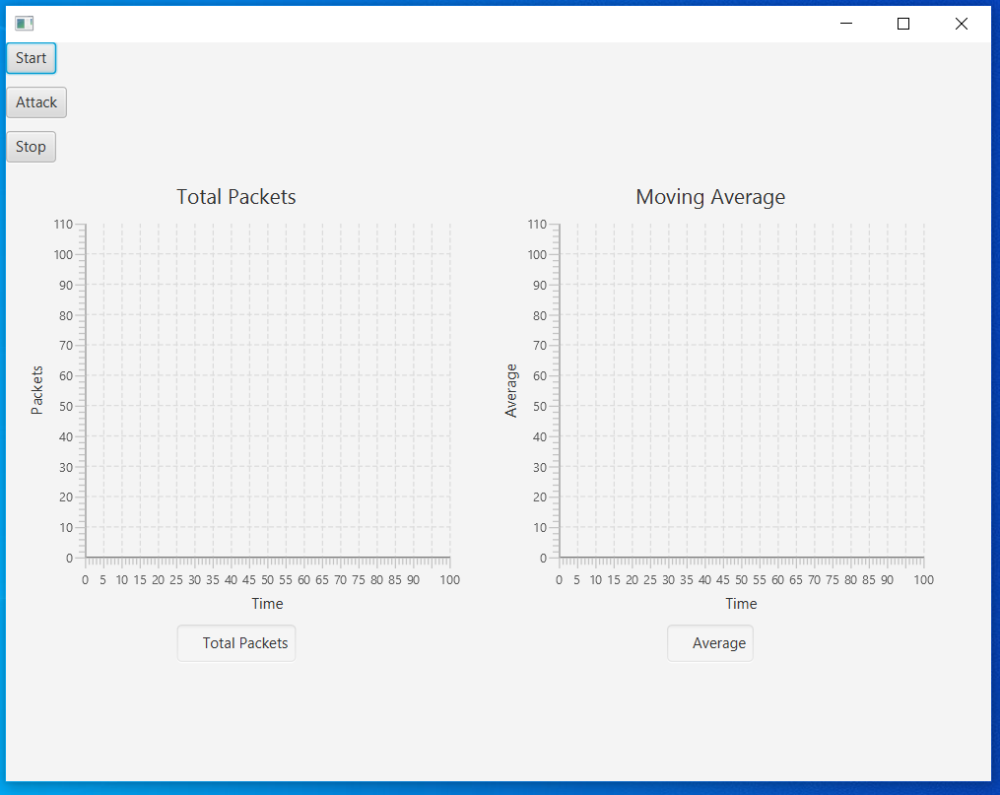
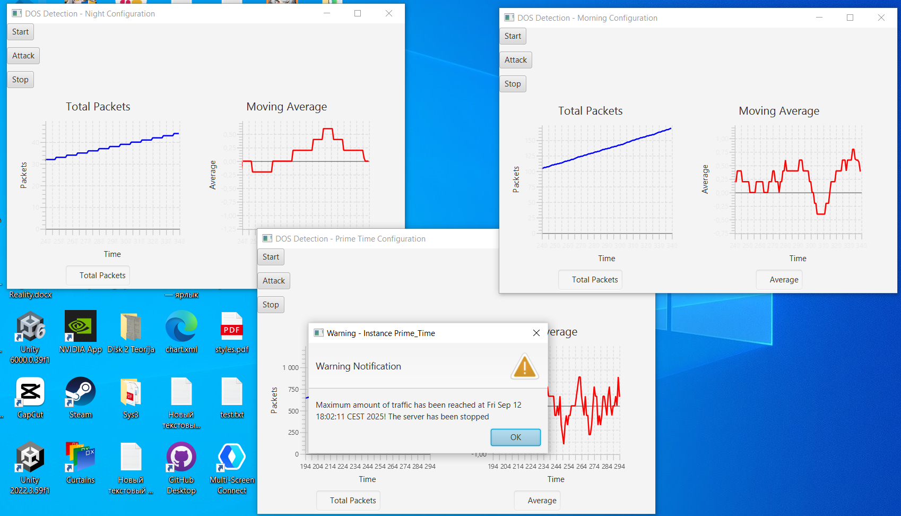
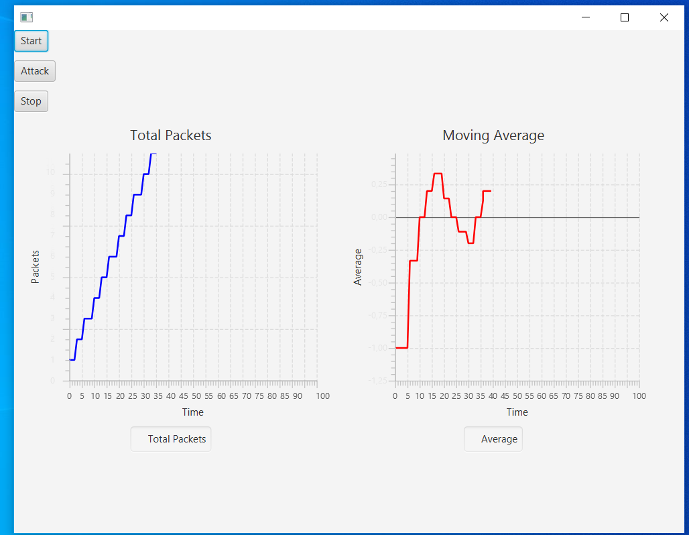

markdown
# DOS Detection

This project is my first exploration into concurrent programming, developed as part of the **Programming 3** course. It simulates and analyzes **Denial of Service (DOS) attacks** using Java, featuring a moving average algorithm to detect suspicious network activity. The application provides a graphical user interface (GUI) for real-time visualization of packet statistics and attack simulations.

## Branches and Technologies

There are **three independent versions** of the project, accessible via different GitHub branches. Each branch implements the same core logic but uses different technologies:
- **JavaFX Version:** Uses JavaFX for the GUI and concurrency.
- **Multithreaded Version:** May use alternative Java technologies for concurrency and visualization.
- **Distributed Version:** Utilizes MPJ (Message Passing in Java) and JPanel for distributed simulation.

Switch branches in the repository to explore each implementation.

## Features

- **Packet Sender:** Simulates normal and attack traffic.
- **DOS Detector:** Monitors incoming packets, calculates moving averages, and triggers warnings.
- **App Class:** Manages multiple detector instances and provides a user interface.
- ### Screenshots
There are some screenshots representing the project in action:
- **Main GUI:**
  
  

- **Attack Simulation:**
- 

- **Instance Configuration:**
- 

## System Design

- **DOSDetector:** Detects anomalies in packet flow using configurable thresholds.
- **PacketSender:** Sends packets at randomized intervals, with increased frequency during attack mode.
- **App/InstanceController:** Manages GUI and instance configurations, displaying real-time charts and logs.

## Algorithms

- **Moving Average:** Uses a sliding window to detect anomalies in packet validity.
- **Threshold Detection:** Triggers warnings and server shutdowns based on configurable limits.

## Simulation and Results

- Multiple instance profiles (Prime_Time, Morning, Night) with unique thresholds.
- Supports both sequential and multithreaded (concurrent) operation.
- Multithreaded version demonstrates increased throughput and independent node operation.

## Requirements

- **Java SDK 21** or later
- Dependencies (e.g., JavaFX, MPJ, etc. depending on branch)